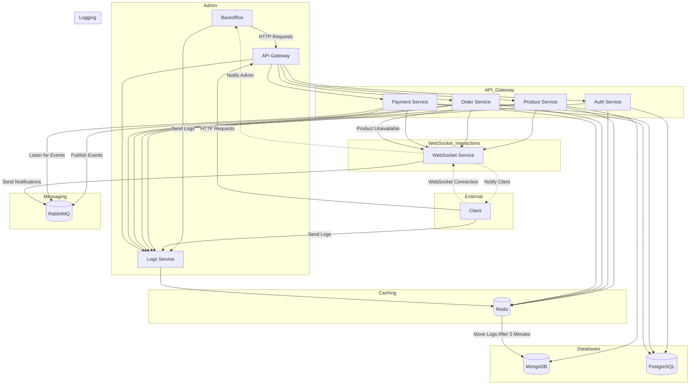

# E-commerce
E-commerce Project base on microservices architecture

Overall Architecture

```mermaid
graph TD

    %% Backoffice Admin Interactions
    subgraph Admin
        direction TB
        backoffice[Backoffice] -->|HTTP Requests| api_gateway
        backoffice -->|Send Logs| logs_service[Logs Service]
    end

    %% External Client (Customer)
    subgraph External
        direction TB
        client[Client] -->|HTTP Requests| api_gateway[API Gateway]
        client -->|Send Logs| logs_service
    end
    
    %% API Gateway routes to microservices
    subgraph API_Gateway
        direction TB
        api_gateway --> product_service[Product Service]
        api_gateway --> auth_service[Auth Service]
        api_gateway --> order_service[Order Service]
        api_gateway --> payment_service[Payment Service]
    end

    %% Microservices to their databases
    subgraph Databases
        direction TB
        product_service --> mongo[(MongoDB)]
        auth_service --> postgres[(PostgreSQL)]
        order_service --> postgres
        payment_service --> postgres
    end

    %% Redis for caching and temporary log storage
    subgraph Caching
        direction TB
        product_service --> redis[(Redis)]
        auth_service --> redis
        order_service --> redis
        payment_service --> redis
        logs_service --> redis
    end

    %% Message broker (RabbitMQ) for inter-service communication
    subgraph Messaging
        direction TB
        order_service -->|Publish Events| rabbitmq[(RabbitMQ)]
        payment_service -->|Listen for Events| rabbitmq
    end

    %% Logs Service
    subgraph Logging
        direction TB
        auth_service --> logs_service
        product_service --> logs_service
        order_service --> logs_service
        payment_service --> logs_service
        api_gateway --> logs_service
    end

    %% Move logs from Redis to MongoDB after 5 minutes
    redis -->|Move Logs After 5 Minutes| mongo

    %% WebSocket interactions
    subgraph WebSocket_Interactions
        direction TB
        client -.->|WebSocket Connection| websocket_service[WebSocket Service]
        websocket_service -.->|Notify Client| client
        websocket_service -.->|Notify Admin| backoffice
        websocket_service -->|Send Notifications| rabbitmq
        product_service --> websocket_service
        order_service --> websocket_service
        payment_service --> websocket_service
        product_service -->|Product Unavailable| websocket_service
    end
```
